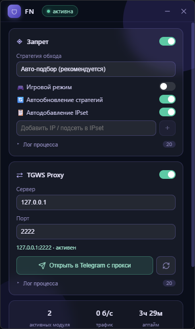

# FN

FN — Windows-приложение с компактным интерфейсом для управления
[Zapret](https://github.com/Flowseal/zapret-discord-youtube) и
[TGWS Proxy](https://github.com/Flowseal/tg-ws-proxy) от Flowseal.

Приложение объединяет стратегии обхода DPI, IPSet, локальный MTProto-прокси
для Telegram, автозапуск и управление фоновыми процессами в одном окне.

## Интерфейс



## Возможности

### Zapret

- запуск и остановка `winws.exe`;
- автоматическое обнаружение BAT-стратегий;
- обновление списка стратегий после выбора другой папки;
- автоматический подбор рабочей стратегии;
- игровой режим;
- управление IPSet и добавление IP/подсетей из интерфейса;
- автоматическое обновление списков;
- журнал работы процесса.

### TGWS Proxy

- встроенный headless TGWS 1.8.1 без отдельного значка в трее;
- запуск прокси на выбранном адресе и порте;
- хранение MTProto `secret` в конфигурации FN;
- создание нового `secret` из интерфейса;
- подключение прокси в Telegram по `tg://proxy`;
- автоматический запуск TGWS при открытии Telegram через FN.

### Приложение

- сворачивание в системный трей вместо завершения работы;
- восстановление активных модулей после перезапуска;
- автозапуск через Планировщик заданий Windows с повышенными правами;
- скрытый запуск в трей через 10 секунд после входа в Windows;
- отображение активных модулей, системного трафика и времени работы;
- плавная прокрутка и компактный интерфейс размером 380 x 640;
- запуск приложения и установщика с правами администратора.

## Установка

1. Скачайте `FN_<version>_x64-setup.exe` со страницы Releases.
2. Запустите установщик и подтвердите запрос контроля учётных записей Windows.
3. После установки откройте FN через меню «Пуск» или ярлык.

Установщик работает без обязательного подключения к интернету и включает:

- FN;
- Zapret и WinDivert;
- headless TGWS Proxy;
- Microsoft Visual C++ Runtime x64;
- офлайн-установщик Microsoft WebView2 Runtime.

Node.js, Rust и Python конечному пользователю не требуются. Установщик заранее
размещает рабочие компоненты в `%APPDATA%\FN`, поэтому первая активация модулей
не должна загружать дополнительные программы.

> Установщик пока не подписан сертификатом разработчика. Windows SmartScreen
> может показать предупреждение о неизвестном издателе.

## Использование

### Выбор стратегии

Выберите стратегию в карточке Zapret и включите модуль. FN запускает параметры
из соответствующего BAT-файла. Для собственного комплекта нажмите «Выбрать
папку Запрета» и укажите каталог, содержащий `bin\winws.exe` и BAT-стратегии.
Список в интерфейсе обновится автоматически.

### Telegram Proxy

Включите TGWS Proxy и нажмите «Открыть в Telegram с прокси». FN сформирует
MTProto-ссылку с текущими адресом, портом и `secret`. Кнопка обновления рядом
создаёт новый `secret` и перезапускает активный прокси.

### Автозапуск

Переключатель «Автозапуск» создаёт задачу `FN Autostart` для текущего
пользователя. При входе в Windows FN запускается с максимальными правами,
остаётся скрытым в трее и восстанавливает ранее активные модули. При удалении
приложения задача удаляется установщиком.

## Данные приложения

| Путь | Назначение |
|---|---|
| `C:\Program Files\FN` | установленное приложение и встроенные ресурсы |
| `%APPDATA%\FN\config.json` | настройки FN и TGWS secret |
| `%APPDATA%\FN\zapret` | рабочая копия Zapret, стратегии и списки |
| `%APPDATA%\FN\tgws` | headless TGWS Proxy |

## Сборка из исходников

### Требования

- Windows 10/11 x64;
- Node.js LTS 18 или новее;
- Rust stable с MSVC toolchain;
- Visual Studio Build Tools с компонентом «Desktop development with C++»;
- Python 3.12 x64 для первой сборки headless TGWS;
- PowerShell и `curl.exe`.

### Команды

```powershell
npm install
npm run check
npm run tauri dev
npm run tauri build
```

Перед release-сборкой `scripts/prepare-resources.ps1`:

1. скачивает Zapret 1.9.9d;
2. собирает headless TGWS 1.8.1 из вложенных исходников, если EXE отсутствует;
3. скачивает Microsoft Visual C++ Runtime x64;
4. проверяет цифровую подпись Microsoft;
5. передаёт ресурсы Tauri для создания NSIS-установщика.

Сборочные зависимости и скачанные бинарники не хранятся в Git.

## Структура проекта

| Путь | Назначение |
|---|---|
| `src/` | интерфейс Svelte и TypeScript |
| `src/lib/api.ts` | типизированные вызовы Tauri-команд |
| `src/lib/components/` | карточки модулей, переключатели, статистика и уведомления |
| `src-tauri/src/zapret.rs` | установка, стратегии, запуск Zapret и IPSet |
| `src-tauri/src/tgws.rs` | управление TGWS, secret и Telegram-ссылками |
| `src-tauri/src/autostart.rs` | автозапуск через Планировщик заданий Windows |
| `src-tauri/src/tray.rs` | системный трей и его меню |
| `src-tauri/windows/installer-hooks.nsh` | подготовка компонентов установщиком |
| `src-tauri/resources/tgws/source/proxy/` | исходники TGWS 1.8.1 |
| `scripts/prepare-resources.ps1` | подготовка production-ресурсов |
| `scripts/build-tgws-headless.ps1` | сборка TGWS без tray-интерфейса |
| `scripts/export-github-source.ps1` | создание лёгкого архива исходников |

## Публикация на GitHub

Не добавляйте в репозиторий `node_modules`, `.build`, `dist`,
`src-tauri/target`, установщики и скачанные EXE/DLL. Эти пути уже перечислены
в `.gitignore`.

Создать готовый архив исходников:

```powershell
npm run source:zip
```

Команда создаст `FN_<version>_GitHub_Source.zip`. Распакуйте архив и загрузите
его содержимое в репозиторий. Готовый установщик публикуйте отдельно в GitHub
Releases.

## Технологии

- Tauri 2;
- Rust;
- Svelte 4;
- TypeScript;
- WinDivert;
- NSIS;
- Microsoft WebView2.

## Сторонние компоненты

FN использует и распространяет сторонние компоненты с сохранением их файлов
лицензий и уведомлений:

- Flowseal Zapret / zapret-discord-youtube;
- Flowseal TGWS Proxy;
- WinDivert;
- Microsoft Visual C++ Runtime;
- Microsoft WebView2 Runtime.

Права на сторонние компоненты принадлежат их авторам.
